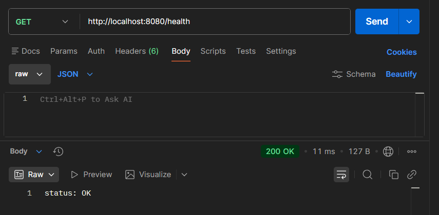
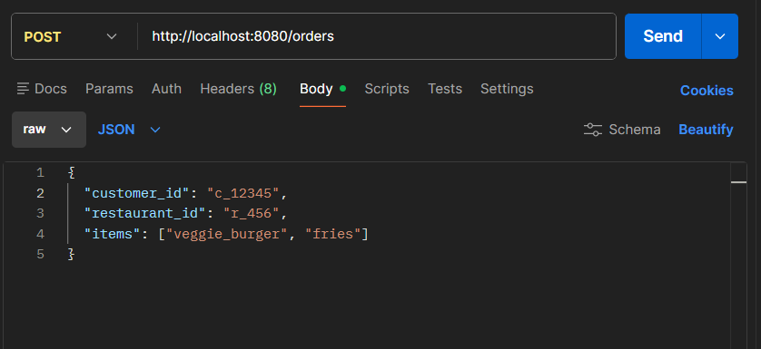
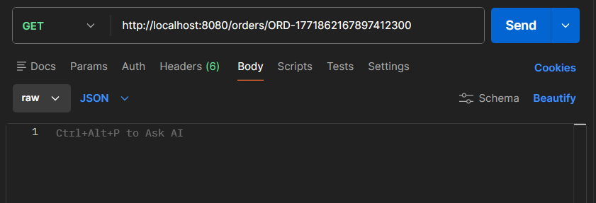
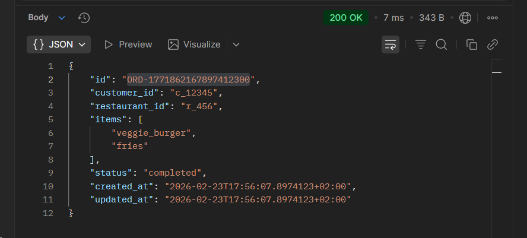

# order-processing-service
 **Work in Progress ...**

A concurrent order processing system built in Go, demonstrating goroutines, channels, and thread-safe storage patterns for handling delivery orders at scale.

## Features

- **Concurrent Processing**: Worker pool with 5 goroutines processing orders in parallel
- **Thread-Safe Storage**: In-memory storage with mutex locks for safe concurrent access
- **Asynchronous Queue**: Buffered channel (capacity: 100) for order queue management
- **RESTful API**: HTTP endpoints for order creation and status tracking
- **Graceful Shutdown**: Proper cleanup of resources on termination

---

## Architecture Diagram


---

## Project Structure

```
order-processing-service/
├── cmd/
│   └── server/
│       └── main.go          # Entry point, wires everything together
├── internal/
│   ├── handler/
│   │   └── api.go           # HTTP handlers (createOrder, GetOrder, GetAllOrders)
│   ├── models/
│   │   └── order.go         # All structs
│   ├── storage/
│   │   └── memory.go        # Thread-safe in-memory store (RWMutex)
│   └── worker/
│       └── pool.go          # Worker pool — goroutines + channel
└── go.mod
```

---

## API Endpoints

| Method | Endpoint | Description |
|--------|----------|-------------|
| `POST` | `/orders` | Create a new order |
| `GET` | `/orders` | Get all orders |
| `GET` | `/orders/{id}` | Get order by ID |
| `GET` | `/health` | Health check |

---

## Tech Stack

- **Language:** Go
- **Concurrency:** goroutines, channels, `sync.RWMutex`, `sync.WaitGroup`
- **Storage:** in-memory (`map[string]*Order`)
- **HTTP:** `net/http` (standard library, no frameworks)

---

## Testing

API endpoints can be tested manually using [Postman](https://postman.com)

---

## Running the Service

```bash
# Clone the repo
git clone https://github.com/imhaqer/order-processing-service
cd order-processing-service

# Run
go run ./cmd/server/main.go
```

Server starts on `:8080`

---

## Demo

### Start the Server


---

### GET /health — Health check


---

### POST /orders — Create an order
**Request**


**Response — 201 Created (status: pending)**


---

### GET /orders/:id — Get order by ID
**Request**


**Response — 200 OK (status: completed)**


---

### GET /orders — Get all orders


---

### Graceful Shutdown


---
## Resources

- [A Tour of Go](https://go.dev/tour/list)
- [Channels in Go: A Comprehensive Guide](https://abubakardev0.medium.com/understanding-channels-in-go-a-comprehensive-guide-a5a9f823c709)
- [net/http — Go standard library docs](https://pkg.go.dev/net/http)
- [Go net/http Package — Client and Server](https://clouddevs.com/go/net-http-package-client-and-server/)
- [video: Go Toturial (Golang) for Beginners](https://www.youtube.com/watch?v=etSN4X_fCnM&list=PL4cUxeGkcC9gC88BEo9czgyS72A3doDeM)
- [video: Your first HTTP server in Go - Go Web Basics #1](https://youtu.be/Xy0DfAElY_Y)
- [video: The Cost of Switching to Kernel Mode](https://youtu.be/KFcyF66IeuE)
